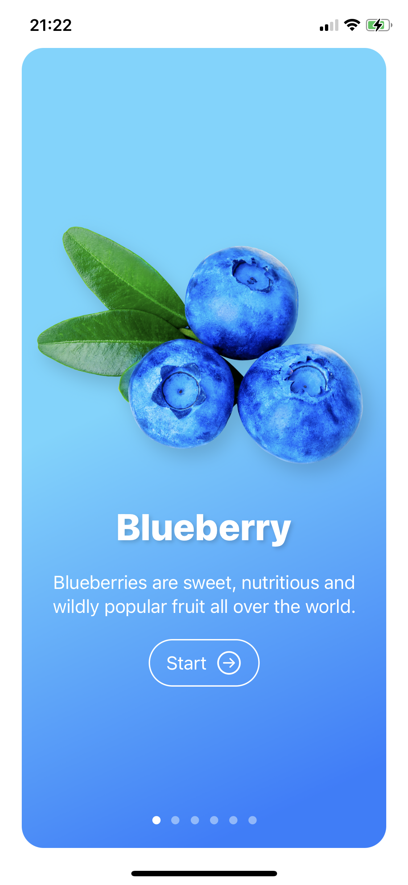
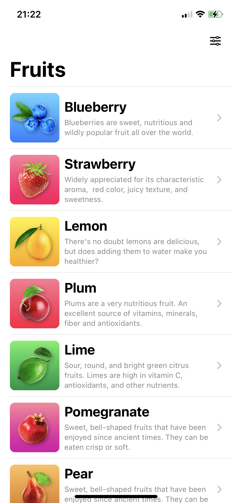
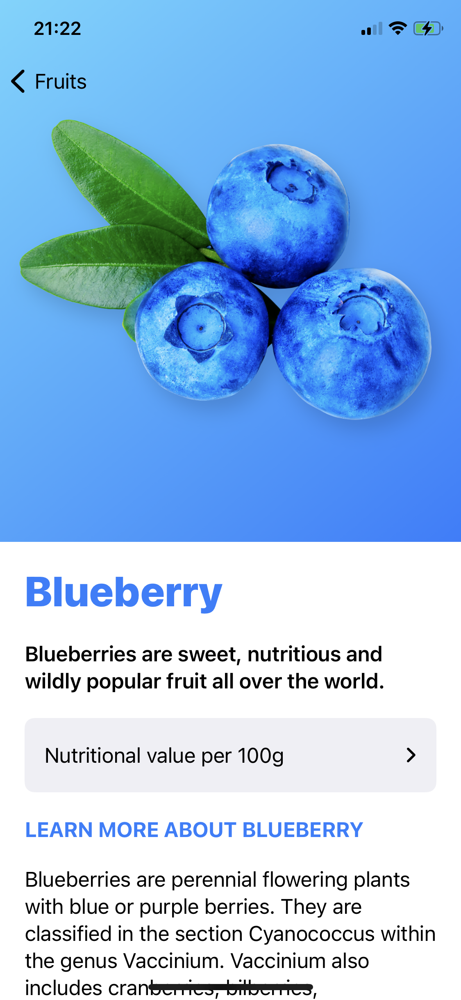
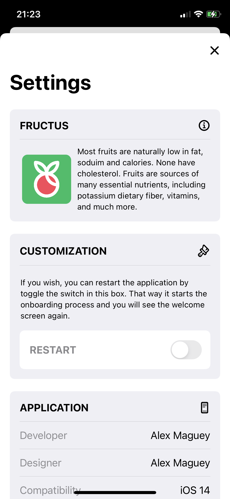

# Fruits iOS
Most fruits are naturally low in fat, soduim and calories. None have cholesterol.
Fruits are sources of many essential nutrients, including potassium dietary fiber, vitamins, and much more.

## Technologies and objectives
* Create an onboarding screen using TabView
* Create the app using Swift UI
* Use AppStorage
* Create custom Views
* Retrieve local data using Structs
* Display multiple Views automatically with ForEach loop
* Use scroll view, horizontal view, vertical view containers
* Create a Settings view
* Add Icons to the App

## Screenshots

